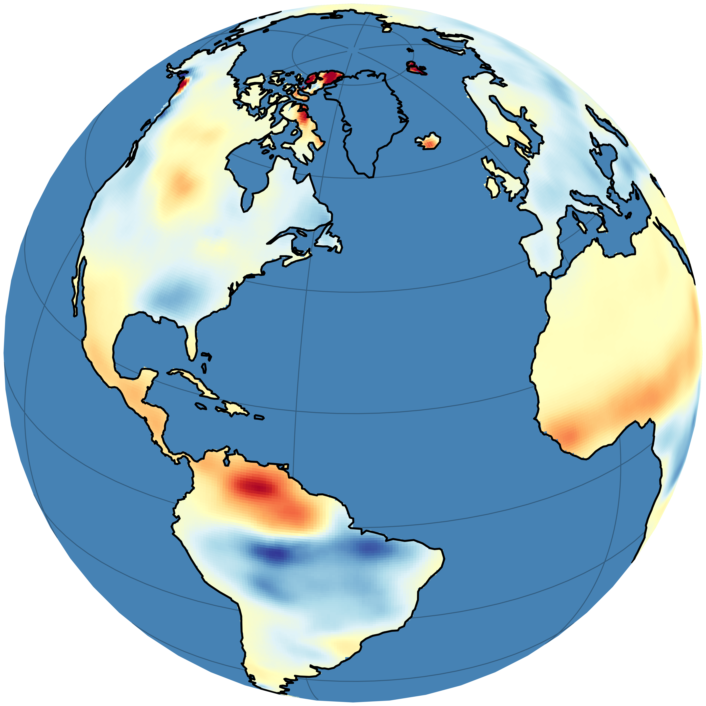

# DeepRec: Global Terrestrial Water Storage Reconstruction Since 1941 Using Spatiotemporal-Aware Deep Learning Model

    

## Description

This repository contains the code base used to create the results presented in "DeepRec: Global Terrestrial Water Storage Reconstruction Since 1941 Using Spatiotemporal-Aware Deep Learning Model". The data processing, model training and evaluation is implemented in Python and heavily depends on the packages [xarray](https://docs.xarray.dev/en/stable/), [PyTorch](https://pytorch.org/docs/stable/index.html), and [PyTorch Lightning](https://lightning.ai/docs/pytorch/stable/).

## Project structure

    .
    ├── config                          <- Stores configuration files for data preprocessing, training, and plotting
    │   ├── ensembles_paper             <- Configurations of ensemble members with different input features
    │   ├── prepocessing_config.yaml    <- Data preprocessing configuration
    │   └── style_paper.mplstyle        <- Matplotlib style sheet for plots
    ├── data                            <- Raw and processed inputs (content excluded from this repository)
    ├── deeprec                         <- Source code
    │   ├── data                        <- PyTorch Lightning dataset and datamodule implementations
    │   ├── models                      <- PyTorch model implementations
    │   ├── preprocessing               <- Functions for data preprocessing
    │   ├── accessors.py                <- Custom xarray and pandas "dr" accessors (e.g., use "DataArray.dr.select_basins()")
    │   └── ...
    ├── figures                         <- Matplotlib-generated figures for the paper and supporting information
    ├── jobs                            <- Slurm scripts to train models on the ETHZ Cluster
    ├── models                          <- Model predictions and final products (content excluded from this repository)
    ├── notebooks                       <- Notebooks used for evaluations
    ├── scripts                         <- Scripts for data processing and model training / predicting
    ├── LICENSE                         <- Open-source license
    ├── pyproject.toml                  <- Project configuration file, makes `deeprec` pip installable ("pip install -e .")
    ├── README.md                       <- This file
    └── uv.lock                         <- Lockfile to reproduce the installation with uv (cross-plattform)

The project structure is based on the [Cookiecutter Data Science](https://cookiecutter-data-science.drivendata.org/) project template.

## Installation

Clone this repository to a directory of your choice:

    git clone https://github.com/lqgentner/deeprec.git
    cd deeprec

Make sure that Python 3.11 or later is installed on your system:

    # Windows
    python --version

    # Linux and MacOS
    python3 --version

### Recreating the environment with uv

If you use the [uv](https://docs.astral.sh/uv/) package manager, you can create the virtual environment and install all packages with one command. It installs `deeprec` as editable package. This also installs all dependencies for the package itself and for running all scripts (preprocessing and model training).

    uv sync

If you want to download the data sets required for model training or want to run the notebooks used for creating the plots, install the optional dependencies with:

    # For downloading the data sets
    uv sync --extra download

    # For running the notebooks
    uv sync --extra plot

    # For installing all optional dependencies
    uv sync --all-extras

### Recreating the environment with pip and venv

If you do not want to use uv, you can also use the tools shipped with Python. First, create a new virtual environment:

    python -m venv .venv

Second, activate the virtual environment. On Windows, run one of the following scripts:

    # In cmd.exe
    .venv\Scripts\activate.bat

    # In PowerShell
    .venv\Scripts\Activate.ps1

On Linux or macOS, use the source command:

    source .venv/bin/activate

Last, install `deeprec` as editable package. This also installs all dependencies for the package itself and for running all scripts (preprocessing and model training).

    pip install -e .

If you want to download the data sets required for model training or want to run the notebooks used for creating the plots, install the optional dependenices with:

    # For downloading the data sets
    pip install -e ".[download]"
    # For running the notebooks
    pip install -e ".[interactive]"
    # For installing all optional dependencies
    pip install -e ".[complete]"

## Usage

To replicate our analysis, run the scripts in the folder of the same name.

- Download all datasets. This requires NASA Earthdata account credentials saved in a `.netrc` file ([how to](https://urs.earthdata.nasa.gov/documentation/for_users/data_access/curl_and_wget)) and a Copernicus CDS API token saved in a `.cdsapirc` ([how to](https://cds.climate.copernicus.eu/how-to-api)) file:

        python scripts/0-download-data.py

- Preprocess the inputs and targets (time step alignment, resampling, anomaly calculation, ...):

        python scripts/1-preprocess-data.py config/preprocessing_config.yaml

- Preprocess the basin and country shapes:

        python scripts/2-clean-shapefiles.py

- Preprocess the previous TWSA reconstructions and simulations:

        python scripts/3-clean-reconstructions.py

- Train a model (requires a GPU and a [Weights & Biases](https://wandb.ai/site/) account):

        python scripts/4-model-train.py --config config/model-configs/train-era.yaml

- Evaluate a model on the test set:

        python scripts/5-model-test.py --help

- Generate the TWSA reconstruction for a trained model:

        python scripts/6-model-predict.py --help

- Combine uncertainty estimates of individual models (deep ensemble approach):

        python scripts/7-mix-ensemble.py --help

- Save ensemble mixture (mean TWSA and combined predictive uncertainty) as netCDF file

        python scripts/8-write-results-mixture.py config/output-configs/mixture-era.yaml

- Save individual model predictions as netCDF file

        python scripts/9-write-results-members.py config/output-configs/members-era.yaml
