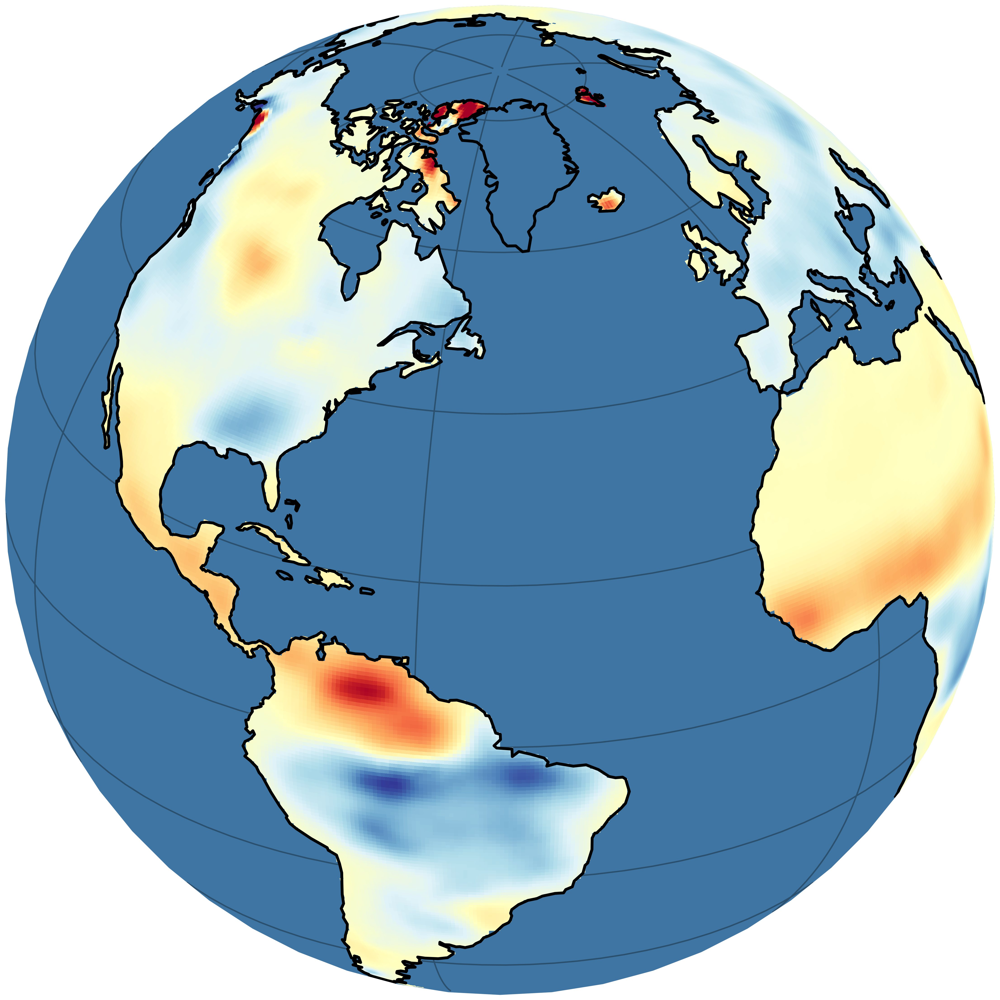

# DeepWaters: Reconstructing Pre-GRACE Terrestrial Water Storage Anomalies Using Deep Learning

    

This repository contains the code base accompanying the master's thesis "Reconstructing Pre-GRACE Terrestrial Water Storage Anomalies Using Deep Learning" (Luis Gentner, 2024). The data processing, model training and evaluation is implemented in Python and heavily depends on the packages [Xarray](https://docs.xarray.dev/en/stable/), [PyTorch](https://pytorch.org/docs/stable/index.html), and [PyTorch Lightning](https://lightning.ai/docs/pytorch/stable/).

## Project structure

    .
    ├── config
    │   ├── global-ensemble_crossval    <- Configurations of cross-validation ensemble
    │   ├── prepocessing_config.yaml    <- Data preprocessing configuration
    │   └── style_paper.mplstyle        <- Matplotlib style sheet for plots
    ├── data                            <- Raw and processed inputs (content excluded from this repository)
    ├── deepwaters                      <- Source code 
    │   ├── data                        <- PyTorch Lightning Datasets and DataModules
    │   ├── models                      <- PyTorch model implementations
    │   ├── preprocessing               <- Functions for data preprocessing
    │   ├── accessors.py                <- Custom xarray and pandas "dw" accessors (e.g., use with "DataArray.dw.select_basins()")
    │   └── ...
    ├── docs                            <- Figures created for the thesis
    ├── jobs                            <- Slurm scripts to train models on the ETHZ Cluster
    ├── models                          <- Model predictions and final products (content excluded from this repository)
    ├── notebooks                       <- Notebooks used for evaluations
    ├── scripts                         <- Scripts for data processing and model training / predicting
    ├── requirements.txt                <- The requirements file for reproducing the analysis environment
    └── setup.py                        <- makes `deepwaters` pip installable ("pip install -e .")

The project structure is based on the [cookiecutter data science project template](https://drivendata.github.io/cookiecutter-data-science/).

## Replicating the analysis

Clone this repository to a directory of your choice:

    git clone https://github.com/lqgentner/deepwaters.git

Make sure that Python 3.11 or later is installed on your system:

    python --version

Create a new virtual environment:

    cd deepwaters
    python -m venv .venv

Activate the virtual environment. On Windows, use:

    .venv\Scripts\activate.bat

Install all package dependencies. To exactly replicate this analysis, you can install the same package versions:

    pip install -r requirements.txt

In case you installed the packages manually, make sure that `deepwaters`, the package included in this repository, is installed. If you want to make changes to the repository, install `deepwaters` as an editable package:

    pip install -e .
